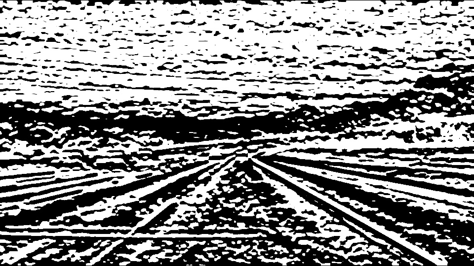

# **Finding Lane Lines on the Road** 

#### This project is a part of Udacity's Self-Driving Engineer nanodegree program. It aims to create a software pipeline for identifying lane lines on the road in a video recorded by a camera mounted on the car's roof using image processing and computer vision techniques. 

## Solution Approach

 I have built a software pipeline to detect lane lines in an image (i.e., a frame of the video) using five core concepts of image processing and computer vision. A brief description of these concepts is as follows. 
  
 

- As a first step, I have converted the input color image into a grayscale image. 
- Next, I have applied the Gaussian blur to minimize the noise in the grayscale image. 
- Then, I have applied the Canny edge detection algorithm on the blur grayscale image to retrieve the edges in the image. 
- Next, I have masked out a quadrilateral region of interest from the image since lane lines in the image are found in a specific area. 
- After that, I have applied the Hough transform to extract line segments from Canny edges.
- Then, I have divided the extracted line segments into left and right lane lines, and eliminated the horizontal lines basaed on their slopes. 
- Finally, I have trained two linear regression models to extrapolate the endpoints of the left and right lane lines. Finally, I have embedded the predicted lane lines on the original image.

## Convert Color Image to Grayscale Image
As a first step, the software pipeline extracts the image frame from the given video stream and converts the color image to a grayscale image (an image having shades of gray). The reason for converting the color image to a grayscale image is that it helps simplify the algorithm and eliminates the complexities related to computational requirements. Below is an example of a color image converted to a grayscale image.

<table>
 

  <tr>
    <td>solidWhiteCurve</td>
     <td>gray_solidWhiteRight</td>
  </tr>
  <tr>
     <td>  </td>
     <td>  </td>
  </tr>
 

 </table>

## Apply Gaussion Blur
Edge detection results are susceptible to image noise as the edge detection algorithm is based on gradient calculation. To eliminate noise, the software pipeline convolutes the grayscale image using the Gaussian filter. After applying the Gaussian blur to a grayscale image, we get the following results.

<table>
 

  <tr>
    <td>Grayscale Image</td>
     <td>Blur Image</td>
  </tr>
  <tr>
     <td>  </td>
     <td>  </td>
  </tr>
 

 </table>

## Canny Edge Detection Algorithm
An edge in an image is a significant local change in the image intensity, usually associated with a discontinuity in either the image intensity or in the first derivative (i.e., gradient) of the image intensity.

The Canny edge detection algorithm has four key steps: gradient calculation, non-maximum suppression, double thresholding, and edge tracking by hysteresis. In the following, I will briefly discuss these steps.

- Gradient Calculation: This step first detects pixel intensity in `x` and `y` directions by convolving the blur image with the Sobel filter. Next, it calculates the magnitude and direction of the image gradient. Below is the output of the gradient calculation step.

<table>
   

  <tr>
      <td>Blur Image</td>
    <td>Sobelx Image</td>
     <td>Sobely Image</td>
     <td>Gradient Image</td>
  </tr>
  <tr>
       <td>  </td>
     <td>  </td>
     <td>  </td>
      <td>  </td>
  </tr>
 

</table>

- Non-max Suppression: Notice that in the above gradient image, some edges are thick, and others are thin, and the gradient intensity is not uniform. To deal with this, the Canny edge detection algorithm applies non-max suppression to eliminate thick edges. Non-max suppression compares each pixel's intensity with the neighboring pixels in the gradient direction. When the intensity of the current pixel is higher than both the adjacent pixels, the current pixel is preserved; otherwise, it is set to zero. The output of this step is depicted below. 

<table>
 

  <tr>
    <td>Gradient Image</td>
     <td>Non-max Suppressed Image</td>
  </tr>
  <tr>
      <td>  </td>
     <td>  </td>
  </tr>
 

 </table>

- Double Thresholding: The Canny edge detection algorithm uses two thresholds for intensity, i.e., low and high, to find strong, weak, and irrelevant pixels. Pixels with an intensity higher than the high threshold are strong pixels, pixels with an intensity less than the low threshold are irrelevant pixels, and those with an intensity between low and high thresholds are weak pixels. In this step, only the weak and strong pixels are retained, while the irrelevant pixels are suppressed, as shown below.  

<table>
 

  <tr>
      <td>Non-max Suppressed Image</td>
      <td>Double Thresholded Image</td>
  </tr>
  <tr>
     <td>  </td>
       <td>  </td>
  </tr>
 

 </table>

- Edge Tracking by Hysteresis: In this step, a weak pixel is converted into a strong pixel if at least one of the pixels around the weak pixel is a strong pixel. The output is shown below. 

<table>
 

  <tr>
      <td>Double Thresholded Image</td>
      <td>Hysteresis Image</td>
  </tr>
  <tr>
      <td>  </td>
      <td>  </td>
  </tr>
 

 </table>

 ## Extract Region of Interest

 As mentioned before, the lane lines in an image are found in a specific area; I have masked out a quadrilateral region of interest from the edge detected image, as shown below.

 <table>
 

  <tr>
      <td>Hysteresis Image</td>
      <td>Masked Image</td>
  </tr>
  <tr>
      <td>  </td>
      <td>  </td>
  </tr>
 

 </table>

## Apply Hough Transform

Hough transform maps the cartesian pixels of edge detected image into alternative parameter space. Originally, it maps the Cartesian pixels into slope and intercept parameter space. A line in a cartesian system is represented by a point in the slope and intercept Hough space. In contrast, a point (or pixel) in cartesian space is represented by a line in hough space. When two lines in Hough space intersect each other, the pixel points in the edge image are co-linear or belong to a single line.

However, this parameter space cannot represent a vertical as its slope is not defined. An alternative to slope and intercept space is to use rho and theta (i.e., polar parameters) Hough space. In rho and theta space, a point is represented by a cosine curve instead of a straight line. 

All the edge points are transformed into cosine curves; if two edge points belong to a single line in the edge image, then their corresponding curves will intersect in Hough space. Finally, the lines are detected by finding the pairs of rho and theta whose curves intersect in Hough space and thresholding.

## Identify Start and End Points of Lane Lines

The software pipeline then divides the lines detected by Hough transform into the left and right lanes, i.e., the lines with a positive slope belong to the right lane, and the lines with a negative slope belong to the left lane. Also, it eliminates the possible horizontal lines by ignoring lines having a slope within a certain slope range. 

## Train Linear Regression Models

Finally, the pipeline trains two linear regression models using points belonging to left and right lane lines to predict their endpoints. The endpoints of the lanes are used to embed the lane lines on the original image.  

 <table>
 

  <tr>
      <td>Masked Image</td>
      <td>Final Output Image</td>
  </tr>
  <tr>
      <td>  </td>
      <td>  </td>
  </tr>
 

 </table>

## Experimental Results
First, I tested the software pipeline on a set of test images provide by the Udacity, and the results are shown below.  

<table>
 

  <tr>
    <td>solidWhiteCurve</td>
     <td>solidWhiteRight</td>
     <td>solidYellowCurve</td>
  </tr>
  <tr>
     <td>  </td>
     <td>  </td>
     <td>  </td>
  </tr>
  <tr>
    <td>solidYellowCurve2</td>
     <td>solidYellowLeft</td>
     <td>whiteCarLaneSwitch</td>
  </tr>
  <tr>
     <td>  </td>
     <td>  </td>
     <td>  </td>
  </tr>
 

 </table>
 

Thereafter, I have processed two test videos, whose results are are shown below.

https://user-images.githubusercontent.com/14021388/218276303-11c610e7-a675-4f9b-939b-e73f119084b5.mp4 

https://user-images.githubusercontent.com/14021388/218276316-0a4d1d7d-b928-4324-98ec-91821859b556.mp4

## Shortcomings 

One potential shortcoming is that all the parameters of the software pipeline are hardcoded. Therefore, it may not be robust for images (or frames) having different sizes and videos recorded with different orientations. In addition, it is likely to fail when the region of the lane lines is changed, such as in an image of a curvy road. 

### 6. Possible improvements 

A possible improvement would be to adjust the parameters of the software pipeline dynamically for adopting different types of image or video stream configurations.

Another possible improvement would be the usage of advanced computer vision techniques to find the lane lines in images of both straight roads and curvy roads.

